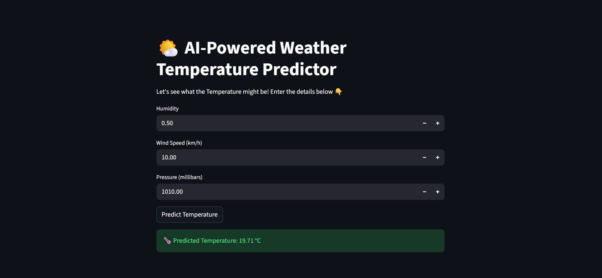

# 🌤️ AI-Powered Weather Temperature Predictor

The **AI-Powered Weather Temperature Predictor** is a **Machine Learning Project** designed to predict the **temperature** based on **humidity, wind speed, and pressure** using a **Linear Regression** model. It includes a Jupyter Notebook for **EDA & model training** and a **Streamlit web app** for interactive predictions.

---

## 🌟 Project Highlights

- Machine Learning-Based Temperature Prediction: Uses key weather parameters for accurate predictions.
- Comprehensive EDA: Includes distribution plots, boxplots, correlation heatmap, and pairplots to understand data patterns.
- Interactive Web Application: Streamlit app for user-friendly temperature prediction.

---

## ⚡Technologies

- **pandas** – Data manipulation and analysis
- **numpy** – Numerical computations and array operations
- **scikit-learn** – Machine learning (Linear Regression)
- **matplotlib** – Data visualization (plots and charts)
- **seaborn** – Advanced statistical data visualization
- **joblib** – Saving and loading trained machine learning models
- **streamlit** – Interactive web application for predictions

---

## 📂 Project Structure

```
Weather_Prediction_App/
│
├── data/
│ └── weatherHistory.csv 
│
├── models/
│ └── weather_temp_model.pkl
│
├── notebooks/
│ └── Weather_Model_Training.ipynb
│
├── app/
│ └── app.py 
│
├── results/ 
│
├── requirements.txt 
└── README.md
```

---

## 🖼 Screenshots

### 🌤️ Weather Prediction App


---

## 💡 How It Works

1. **Data Collection & Preparation**  
   - Uses historical weather data (`weatherHistory.csv`) containing **Temperature, Humidity, Wind Speed, and Pressure**.  
   - Removes missing values and keeps only relevant features for prediction.

2. **Exploratory Data Analysis (EDA)**  
   - Analyzes feature distributions, correlations, and outliers.  
   - Generates visualizations like **histograms, boxplots, correlation heatmap, and pairplots**.  
   - Saves all plots in the `results/` folder.

3. **Model Training**  
   - Trains a **Linear Regression model** using **Humidity, Wind Speed, and Pressure** to predict **Temperature**.  
   - Saves the trained model as `weather_temp_model.pkl` using **joblib**.

4. **Prediction via Streamlit App**  
   - Users input **humidity, wind speed, and pressure** values into the interactive app.  
   - The app loads the trained model and predicts **temperature** in real-time.  

---

## 🔗 Connect with Me

**Kadulla Pravalika**
- GitHub: [Kadulla-Pravalika-28](https://github.com/Kadulla-Pravalika-28)  
- LinkedIn: [linkedin.com/in/kadulla-pravalika](https://www.linkedin.com/in/kadulla-pravalika/)  

---

## 📄 License

This Project is licensed under the **MIT License** – See the [LICENSE](./LICENSE) file for details.